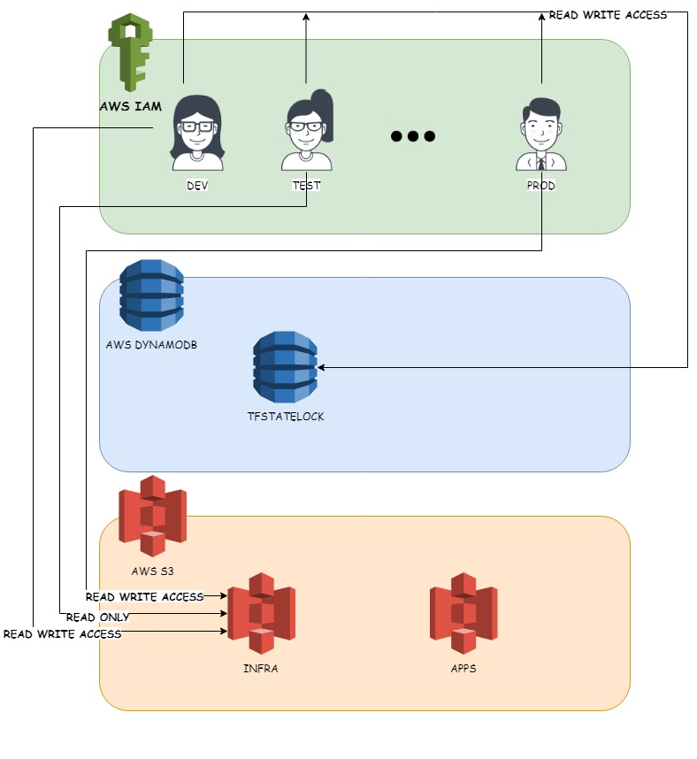

# aws-tf
aws environment management using tf &amp; Jenkins

## terraform remote state design

## Dev SetUp

### Git cmds to clone and make changes

* git clone https://github.com/usowmyas/aws-tf.git
* Navigate to aws-tf
* Execute `git init`
* Execute `git status`
* Change / Add a file 
* Execute `git status` , you should see your changes
* Execute `git add .`
* Execute `git commit -m "NewFile\ChangeFile"`
* Execute `git push -u origin master`

### Prerequisites

* **Install terraform**
 * SSH into your AWS EC2
 * `sudo yum install -y zip unzip` 
 * `unzip terraform_0.11.7_linux_amd64.zip`
 * `sudo mv terraform /usr/local/bin/`
 * `terraform --version` ( should give you the terraform version)

### Terraform plan 

References:
https://github.com/DavidAnson/markdownlint/blob/v0.11.0/doc/Rules.md#md034
